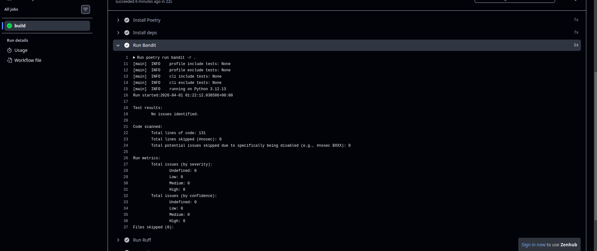
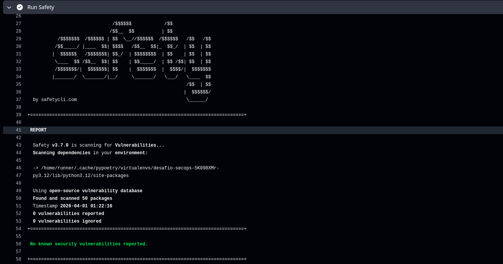
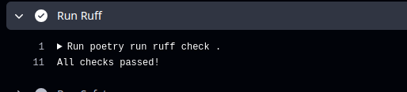
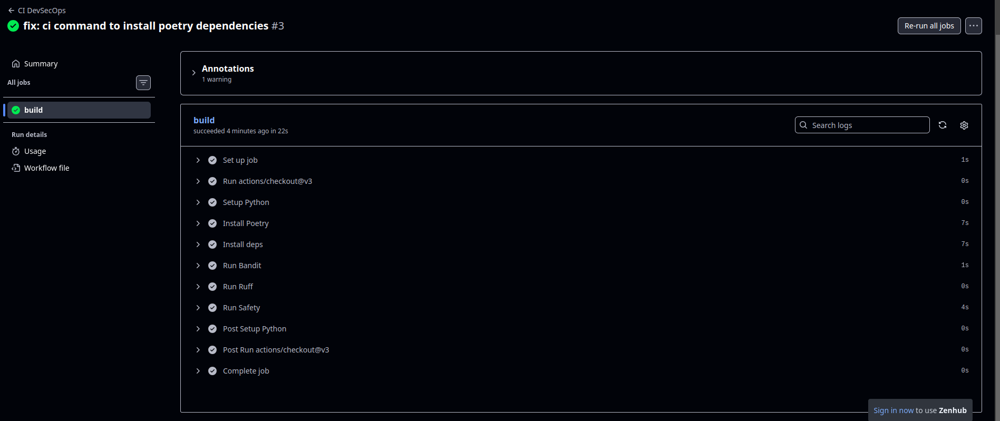
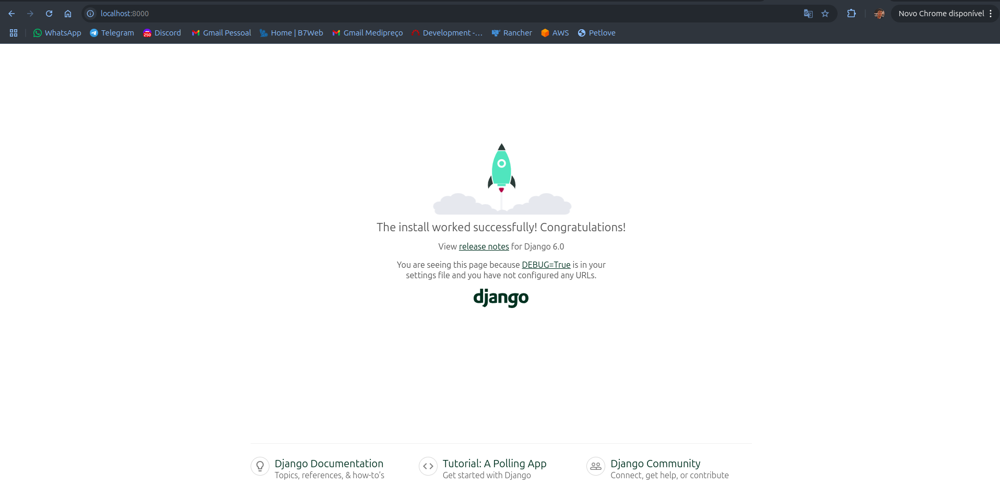

# Relatório de Prontidão Técnica: Onboarding SecOps

**Disciplina:** Engenharia de Produto de Software (FGA0316) - 2026.1  
**Aluno:** [Lucas Caldas Barbosa de Souza] | **Matrícula:** [19/0091606]

## 1. Configuração do Ambiente (Zero Trust & Isolamento)

Conforme as diretrizes de Soberania Técnica, as seguintes configurações foram aplicadas:

- [x] **Python 3.12:** Instalado e verificado.
- [x] **Poetry:** Configurado para criar `.venv` dentro do projeto (`virtualenvs.in-project true`).
- [x] **Determinismo:** Arquivos `pyproject.toml` e `poetry.lock` gerados com sucesso.

## 2. Logs de Auditoria e Qualidade (Security Gate)

Abaixo constam os resumos das execuções dos comandos de segurança:

### 2.1. Auditoria Estática (Bandit)



*Comando: `poetry run bandit -r .`*

### 2.2. Verificação de Dependências (Safety)



*Comando: `poetry run safety check`*

### 2.3. Qualidade e Conformidade (Ruff)



*Comando: `poetry run ruff check .`*

## 3. Evidência de Integração Contínua (CI)

O pipeline automatizado foi executado com sucesso no GitHub Actions:

- **Link da Action de Sucesso:** [https://github.com/lucascaldasb/desafio-secops/actions/runs/23827305514]



## 4. Declaração de Soberania Técnica (CISSP Domain 8)

Eu, Lucas Caldas Barbosa de Souza, declaro que auditei manualmente as ferramentas e dependências deste projeto. Confirmo que o código gerado via IA (GitHub Copilot) passou pela minha revisão humana (*Human-in-the-loop*), garantindo que não há vazamento de segredos ou falhas lógicas críticas antes da migração para o ecossistema da PCDF.

## 5. Evidências de execução local

Capturas de ambiente local (navegador e terminal):




---

**Data de Entrega:** [02/04/2026]


## Apêndice: Repositório e execução local

Projeto Django com foco em segurança, qualidade e CI/CD (Poetry, Ruff, Bandit, GitHub Actions).

### Clonar e instalar

```bash
git clone https://github.com/lucascaldasb/desafio-secops.git
cd desafio-secops
poetry install
```

### Servidor local

```bash
poetry shell
poetry run python manage.py runserver
```

Ou com Docker:

```bash
docker-compose up --build
```

### Comandos úteis (referência)

- Ruff: `poetry run ruff check .`
- Bandit: `poetry run bandit -r .`
